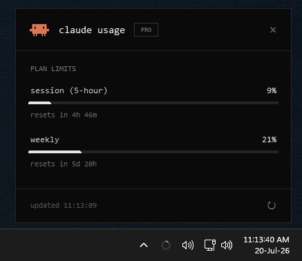
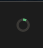
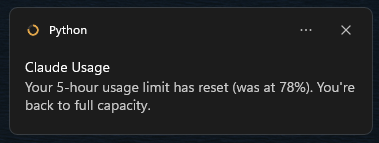

# Claude Usage — Windows tray app

A tiny background app that lives in the Windows system tray and shows your
current Claude usage at a glance. Left-click the icon to pop up a small window;
the icon itself is a ring that turns **green → amber → red** as your 5-hour
session fills up.

<p align="center">
  
</p>

<p align="center">
  
  &nbsp;the tray icon fills and changes color with your 5-hour session.
</p>

<p align="center">
  
</p>

## What it shows

- **Plan limits** — your 5-hour *session* and *weekly* usage %, with reset
  countdowns. Same numbers as Claude Code's `/usage` command, fetched live from
  the OAuth token already stored in `~/.claude/.credentials.json`.
- **Tokens · est. API cost** *(optional, toggle in the tray menu)* — tokens and
  estimated equivalent API cost for *today*, *this month*, and *all time*,
  read from your local Claude Code transcripts in `~/.claude/projects/`.
  Subscription users aren't billed per token — this is a "what it would cost on
  the API" estimate.

## Requirements

- Windows
- Python 3.11+
- `pip install -r requirements.txt`

## Running

```bat
pythonw tray_app.py
```

Or double-click **`Claude Usage.bat`** (a silent launcher — no console window).
To start it automatically at login, drop a shortcut to the `.bat` into your
Startup folder (`shell:startup` in the Run dialog).

- **Refresh:** click the ↻ button, or right-click the tray icon → *Refresh now*.
- **Show/hide cost:** right-click the tray icon → *Show API cost estimate*.
- **Quit:** right-click the tray icon → *Quit*.

## How it works

- `tray_app.py` — the tray icon + popup UI.
- `usage_data.py` — data layer: the `/usage` limits endpoint plus transcript
  parsing.

The app only reads local files plus one authenticated HTTPS GET to
`api.anthropic.com`; it never writes anything except refreshing an expired OAuth
token in place. The `/usage` endpoint is rate-limited, so limits are polled at
most once every 5 minutes (with 429 back-off) and cached locally; token/cost
data refreshes every minute from local files.
