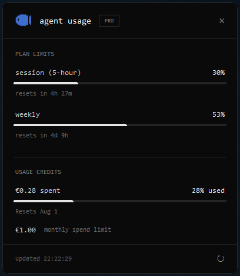
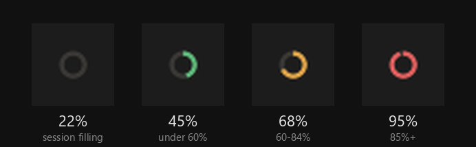
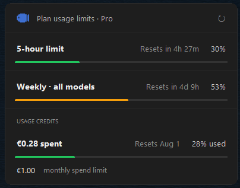
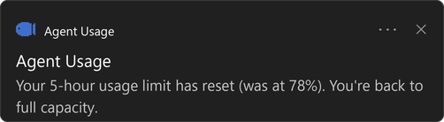

# Agent Usage — Windows tray app

https://youtu.be/vB-A00MWdHA

A tiny background app that lives in the Windows system tray and shows your
current agent usage at a glance — plan limits, estimated API cost, and your
**usage-credit spend** — all in one popup. Left-click the icon to pop up a small
window; the icon itself is a ring that turns **green → amber → red** as your
5-hour session fills up.

  

## The tray icon at a glance

The ring fills clockwise with your 5-hour session usage and changes color by
severity, so you can read your status without clicking. The images below are
real screenshots of the tray icon at different usage levels:

  

| Fill | Color | Meaning |
|------|-------|---------|
| under 60% | 🟢 green  | plenty of session headroom |
| 60–84%    | 🟠 amber  | getting close |
| 85%+      | 🔴 red    | nearly at the 5-hour limit |

## What it shows

- **Plan limits** — your 5-hour *session* and *weekly* usage %, with reset
  countdowns. Same numbers as Claude Code's `/usage` command, fetched live from
  the OAuth token already stored in `~/.claude/.credentials.json`.
- **Tokens · est. API cost** *(optional, toggle in the tray menu)* — tokens and
  estimated equivalent API cost for *today*, *this month*, and *all time*,
  read from your local Claude Code transcripts in `~/.claude/projects/`.
  Subscription users aren't billed per token — this is a "what it would cost on
  the API" estimate.
- **Usage credits** *(optional, toggle in the tray menu)* — your real extra-usage
  spend against your monthly spend limit, in your account currency, shown as a
  plan-limit-style bar: amount spent, **% used**, the reset date, and the
  monthly spend limit. When your limit is set to **unlimited**, it says so (and
  drops the bar, since there's no cap to fill). Same numbers as the *Usage
  credits* panel in Claude's settings, read live from the same `/usage`
  endpoint — not an estimate.

## Designs

The popup ships with two looks, switchable at any time from the tray menu
(**right-click the icon → *Design***). Your choice is remembered between runs.

- **Monochrome** *(default)* — the original flat, monospace card: a single
  accent-free palette with a Claude Code logo header, plain progress bars, and a
  footer showing the last-updated time.
- **Card (colored)** — a softer sans-serif card with a larger Claude logo in the
  header and **color-coded severity bars** for each limit: 🟢 green under 50%,
  🟠 amber 50–79%, 🔴 red 80%+.

  

Both designs have rounded corners and show the same live numbers.

## Notifications

When your 5-hour session limit rolls over, the app pops a Windows toast so you
know you're back to full capacity — no need to open the popup or run `/usage`.

  

## Download (no Python needed)

Grab **`AgentUsage.exe`** from the [latest release](../../releases/latest) — a
single self-contained Windows binary, no Python install required.

1. Put `AgentUsage.exe` in a folder of its own (e.g. `Documents\AgentUsage\`).
2. In that same folder, create a **`.env`** file (copy [`.env.example`](.env.example))
   and fill in `CLAUDE_CLIENT_ID`. The app reads `.env` from the folder the
   `.exe` lives in.
3. Double-click `AgentUsage.exe`. It appears in the system tray.

> **Windows SmartScreen:** the binary is unsigned, so the first launch may show
> *"Windows protected your PC."* Click **More info → Run anyway**. This is
> normal for unsigned open-source apps.

The app writes its cache (`.usage_cache.json`) and settings
(`.app_config.json`) next to the `.exe`. To start it at login, drop a shortcut
to `AgentUsage.exe` in your Startup folder (`shell:startup`).

## How it works

The app only reads local files plus one authenticated HTTPS GET to
`api.anthropic.com`; it never writes anything except refreshing an expired OAuth
token in place. The `/usage` endpoint is rate-limited, so limits are polled at
most once every 2 minutes (with 429 back-off) and cached locally; a manual
*Refresh now* bypasses the interval; token/cost data refreshes every minute from
local files.
